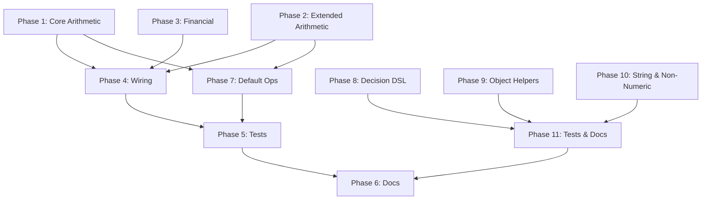

# PLAN: Extended Rule Factories

## Implementation Progress

| Phase | Status | Notes |
|-------|--------|-------|
| Phase 1 — Core Arithmetic | ✅ Done | `difference`, `product`, `negate`, `minimum`, `maximum` |
| Phase 2 — Extended Arithmetic | ✅ Done | `clamp`, `abs`, `round`, `conditional` |
| Phase 3 — Financial Rules | ✅ Done | `futureValue`, `presentValue`, `annuityPayment` — **refactored to ops-aware** (see deviations) |
| Phase 4 — Barrel Exports | ✅ Done | `src/rules.ts` + `src/index.ts` updated incrementally |
| Phase 5 — Tests | ✅ Done | 47 unit tests + 8 integration tests (186 total across monorepo) |
| Phase 6 — Documentation | ✅ Done | README updated, `docs/rule-factories.md` created |
| Phase 7 — Ergonomic Builder | ✅ Done | `algebraicRules(ops)` + `numericRules` — **renamed from plan** (see deviations) |
| Phase 8 — Decision DSL | ⬜ Not started | |
| Phase 9 — Object Helpers | ⬜ Not started | |
| Phase 10 — String/Boolean | ⬜ Not started | |
| Phase 11 — Tests & Docs | ⬜ Not started | |

### Deviations from Original Plan

1. **Financial rules are ops-aware (not number-specific)**
   - Original plan had `futureValue`, `presentValue`, `annuityPayment` as number-specific (no `ops` param).
   - Implemented with `FinancialOps<T>` = `Additive<T> & Scalable<T,T> & Divisible<T,T> & Exponential<T>`.
   - Rationale: Financial applications are the prime use case for custom Decimal/Money types.
   - Added `Exponential<T>` trait (`pow(base, exponent)`) to `algebra.ts`.
   - Added `pow` to `defaultNumberOps`.

2. **`withOps` renamed to `algebraicRules`**
   - Original plan used `withOps(ops)` as the factory name.
   - Renamed to `algebraicRules(ops)` to clearly communicate scope.
   - Rationale: `withOps` implies universality ("all rules bound to ops"), but future string/object rules can't implement `Divisible<string>`. The name `algebraicRules` clarifies these are specifically the rules that require algebra trait implementations.
   - File: `src/rule/algebraic-rules.ts` (not `with-ops.ts`).

3. **`algebraicRules` includes financial methods**
   - Since financial rules are now ops-aware, they're included in `algebraicRules()` alongside arithmetic.
   - The `Exponential<T>` trait is required in the `algebraicRules` constraint.

4. **Rule categorization (final design)**

   | Category | Rules | Ops requirement |
   |----------|-------|----------------|
   | Algebraic (generic `<T>`) | `sum`, `difference`, `negate`, `product`, `scale`, `ratio`, `minimum`, `maximum`, `abs`, `clamp`, `weightedSum`, `futureValue`, `presentValue`, `annuityPayment` | `Order<T> & Additive<T> & Scalable<T,T> & Divisible<T,T> & Exponential<T>` |
   | Number-specific | `round` | None (hardcoded to `number`) |
   | Type-agnostic | `conditional`, `decision`, `projection` | None (work with any `T`) |
   | Future: String/Object (Phases 9-10) | `concat`, `template`, `compose`, `logicalAnd`, etc. | None (standalone factories) |

---

## Motivation

Consumers of weft regularly define custom rule factories for common arithmetic and financial operations that are missing from the core library. Observed patterns include:

- **`difference(target, a, b)`** — subtraction (a − b)
- **`product(target, factors)`** — multiplication of N factors
- **`negate(target, source)`** — unary negation (−source)
- **`minimum(target, a, b)`** / **`maximum(target, a, b)`** — min/max of two values
- **`futureValue(target, rate, nper, pmt, pv)`** — financial future value formula
- Other arithmetic: absolute value, clamping, rounding, conditional

The existing rule factories (`sum`, `ratio`, `scale`, `weightedSum`, `projection`, `decision`) cover addition, division, scalar multiplication, weighted sums, field extraction, and lookup tables — but leave gaps for basic operations like subtraction, multiplication, negation, and comparison.

## Design Principles

1. **Follow existing conventions** — each factory returns `Rule<T>`, accepts an `OpsDescriptor & Trait` for type-generic operations, and produces a typed `spec` for inspection/serialization.

2. **Algebra-aware when possible** — use `Additive<T>.sub` for difference, `Scalable<T,S>.scale` for product, etc. This keeps rules generic over numeric types (money, bigint, custom).

3. **Convenience overloads for `number`** — since most consumers use `defaultNumberOps`, provide "simple" versions that don't require passing ops (e.g., `difference(target, a, b)` that assumes plain numbers).

4. **Inspectable specs** — every factory produces a descriptive `spec` object with an `op` field so inspection trees render meaningful labels (e.g., `[difference]`, `[product]`, `[clamp]`).

5. **`detail` in eval results** — include relevant intermediate values so trace inspection can show how the result was derived.

6. **Financial rules in a separate module** — domain-specific formulas (future value, annuity, NPV) live in their own file/subgroup to keep the core arithmetic set clean.

7. **No new dependencies** — everything uses the existing algebra traits.

## Architecture Overview

```
src/rule/
├── index.ts              ← Rule, Resolver (unchanged)
├── operand.ts            ← Operand<T>, resolveOperand (unchanged)
├── sum.ts                ← existing
├── ratio.ts              ← existing
├── scale.ts              ← existing
├── weighted-sum.ts       ← existing
├── projection.ts         ← existing
├── decision.ts           ← existing
├── rule-meta.ts          ← existing
│
├── difference.ts         ← NEW: subtraction
├── product.ts            ← NEW: multiplication of N factors
├── negate.ts             ← NEW: unary negation
├── min-max.ts            ← NEW: minimum / maximum
├── clamp.ts              ← NEW: clamp(value, min, max)
├── abs.ts                ← NEW: absolute value
├── round.ts              ← NEW: rounding (floor, ceil, round, toFixed)
├── conditional.ts        ← NEW: if-then-else based on a boolean/predicate key
└── financial.ts          ← NEW: futureValue, presentValue, annuityPayment
```

## Task Breakdown

### Phase 1 — Core Arithmetic Rules

#### Task 1.1: `difference(target, a, b)` — Subtraction

**File:** `src/rule/difference.ts`

```ts
import type { Key, KeyId } from "../key";
import type { Additive, OpsDescriptor } from "../semantics/algebra";
import { type Rule, rule } from ".";

export type DifferenceSpec = {
  op: "difference";
  opsDescriptor: OpsDescriptor;
  minuend: KeyId;
  subtrahend: KeyId;
};

export function difference<T>(
  ops: OpsDescriptor & Additive<T>,
  target: Key<T>,
  minuend: Key<T>,
  subtrahend: Key<T>,
): Rule<T> {
  const spec: DifferenceSpec = {
    op: "difference",
    opsDescriptor: { family: ops.family, version: ops.version },
    minuend: minuend.id,
    subtrahend: subtrahend.id,
  };
  return rule({
    target,
    spec,
    deps: [minuend, subtrahend],
    eval: (get) => {
      const output = ops.sub(get(minuend), get(subtrahend));
      return { output };
    },
  });
}
```

Uses `Additive<T>.sub` — same trait that `sum` uses, so any type with additive ops gets subtraction for free.

#### Task 1.2: `product(target, factors)` — Multiplication of N factors

**File:** `src/rule/product.ts`

```ts
import type { Key, KeyId } from "../key";
import type { OpsDescriptor, Scalable } from "../semantics/algebra";
import { type Rule, rule } from ".";

export type ProductSpec = {
  op: "product";
  opsDescriptor: OpsDescriptor;
  factors: readonly KeyId[];
};

export function product<T>(
  ops: OpsDescriptor & Scalable<T, T>,
  target: Key<T>,
  factors: readonly Key<T>[],
): Rule<T> {
  const spec: ProductSpec = {
    op: "product",
    opsDescriptor: { family: ops.family, version: ops.version },
    factors: factors.map((f) => f.id),
  };
  return rule({
    target,
    spec,
    deps: factors,
    eval: (get) => {
      const values = factors.map((f) => get(f));
      const output = values.reduce((acc, v) => ops.scale(acc, v), ops.one());
      return { output, detail: { factors: values } };
    },
  });
}
```

Uses `Scalable<T, T>` with `one()` as the identity. Since `defaultNumberOps` implements `Scalable<number, number>` this works directly.

#### Task 1.3: `negate(target, source)` — Unary Negation

**File:** `src/rule/negate.ts`

```ts
import type { Key, KeyId } from "../key";
import type { Additive, OpsDescriptor } from "../semantics/algebra";
import { type Rule, rule } from ".";

export type NegateSpec = {
  op: "negate";
  opsDescriptor: OpsDescriptor;
  source: KeyId;
};

export function negate<T>(
  ops: OpsDescriptor & Additive<T>,
  target: Key<T>,
  source: Key<T>,
): Rule<T> {
  const spec: NegateSpec = {
    op: "negate",
    opsDescriptor: { family: ops.family, version: ops.version },
    source: source.id,
  };
  return rule({
    target,
    spec,
    deps: [source],
    eval: (get) => {
      const output = ops.sub(ops.zero(), get(source));
      return { output };
    },
  });
}
```

Negate as `zero - value` using additive ops.

#### Task 1.4: `minimum(target, deps)` / `maximum(target, deps)` — Min/Max

**File:** `src/rule/min-max.ts`

```ts
import type { Key, KeyId } from "../key";
import type { OpsDescriptor, Order } from "../semantics/algebra";
import { type Rule, rule } from ".";

export type MinSpec = {
  op: "min";
  opsDescriptor: OpsDescriptor;
  deps: readonly KeyId[];
};

export type MaxSpec = {
  op: "max";
  opsDescriptor: OpsDescriptor;
  deps: readonly KeyId[];
};

export function minimum<T>(
  ops: OpsDescriptor & Order<T>,
  target: Key<T>,
  deps: readonly Key<T>[],
): Rule<T> {
  if (deps.length === 0) throw new Error("minimum requires at least one dependency");
  const spec: MinSpec = {
    op: "min",
    opsDescriptor: { family: ops.family, version: ops.version },
    deps: deps.map((d) => d.id),
  };
  return rule({
    target,
    spec,
    deps,
    eval: (get) => {
      const values = deps.map((d) => get(d));
      const output = values.reduce((acc, v) => (ops.compare(v, acc) < 0 ? v : acc));
      return { output, detail: { values } };
    },
  });
}

export function maximum<T>(
  ops: OpsDescriptor & Order<T>,
  target: Key<T>,
  deps: readonly Key<T>[],
): Rule<T> {
  if (deps.length === 0) throw new Error("maximum requires at least one dependency");
  const spec: MaxSpec = {
    op: "max",
    opsDescriptor: { family: ops.family, version: ops.version },
    deps: deps.map((d) => d.id),
  };
  return rule({
    target,
    spec,
    deps,
    eval: (get) => {
      const values = deps.map((d) => get(d));
      const output = values.reduce((acc, v) => (ops.compare(v, acc) > 0 ? v : acc));
      return { output, detail: { values } };
    },
  });
}
```

Accept N keys (variadic) and use `Order<T>.compare`. This is more flexible than a binary-only version.

---

### Phase 2 — Extended Arithmetic Rules

#### Task 2.1: `clamp(target, value, min, max)` — Bounded Value

**File:** `src/rule/clamp.ts`

```ts
import type { Key, KeyId } from "../key";
import type { OpsDescriptor, Order } from "../semantics/algebra";
import { type Rule, rule } from ".";
import type { Operand } from "./operand";
import { resolveOperand } from "./operand";

export type ClampSpec = {
  op: "clamp";
  opsDescriptor: OpsDescriptor;
  value: KeyId;
  min: unknown;
  max: unknown;
};

export function clamp<T>(
  ops: OpsDescriptor & Order<T>,
  target: Key<T>,
  value: Key<T>,
  min: Operand<T>,
  max: Operand<T>,
): Rule<T> {
  const spec: ClampSpec = {
    op: "clamp",
    opsDescriptor: { family: ops.family, version: ops.version },
    value: value.id,
    min,
    max,
  };
  return rule({
    target,
    spec,
    deps: [value],
    eval: (get) => {
      const v = get(value);
      const lo = resolveOperand(min, get);
      const hi = resolveOperand(max, get);
      let output = v;
      if (ops.compare(v, lo) < 0) output = lo;
      else if (ops.compare(v, hi) > 0) output = hi;
      return { output, detail: { value: v, min: lo, max: hi, clamped: output !== v } };
    },
  });
}
```

Min/max bounds can be `Operand<T>` — either a literal `Value<T>` or a `Key<T>` reference.

#### Task 2.2: `abs(target, source)` — Absolute Value

**File:** `src/rule/abs.ts`

```ts
import type { Key, KeyId } from "../key";
import type { Additive, OpsDescriptor, Order } from "../semantics/algebra";
import { type Rule, rule } from ".";

export type AbsSpec = {
  op: "abs";
  opsDescriptor: OpsDescriptor;
  source: KeyId;
};

export function abs<T>(
  ops: OpsDescriptor & Order<T> & Additive<T>,
  target: Key<T>,
  source: Key<T>,
): Rule<T> {
  const spec: AbsSpec = {
    op: "abs",
    opsDescriptor: { family: ops.family, version: ops.version },
    source: source.id,
  };
  return rule({
    target,
    spec,
    deps: [source],
    eval: (get) => {
      const v = get(source);
      const output = ops.compare(v, ops.zero()) < 0 ? ops.sub(ops.zero(), v) : v;
      return { output };
    },
  });
}
```

#### Task 2.3: `round(target, source, options)` — Rounding

**File:** `src/rule/round.ts`

This is number-specific (rounding doesn't generalize over abstract algebra), so it doesn't take an `OpsDescriptor`:

```ts
import type { Key, KeyId } from "../key";
import { type Rule, rule } from ".";

export type RoundMode = "round" | "floor" | "ceil" | "trunc";

export type RoundSpec = {
  op: "round";
  source: KeyId;
  mode: RoundMode;
  decimals: number;
};

export function round(
  target: Key<number>,
  source: Key<number>,
  options?: { mode?: RoundMode; decimals?: number },
): Rule<number> {
  const mode = options?.mode ?? "round";
  const decimals = options?.decimals ?? 0;
  const spec: RoundSpec = {
    op: "round",
    source: source.id,
    mode,
    decimals,
  };
  const factor = 10 ** decimals;
  return rule({
    target,
    spec,
    deps: [source],
    eval: (get) => {
      const v = get(source);
      const fn = Math[mode];
      const output = fn(v * factor) / factor;
      return { output, detail: { raw: v, mode, decimals } };
    },
  });
}
```

#### Task 2.4: `conditional(target, condition, then, otherwise)` — If/Then/Else

**File:** `src/rule/conditional.ts`

```ts
import type { AnyKey, Key, KeyId } from "../key";
import { type Rule, rule } from ".";
import { type Operand, resolveOperand } from "./operand";

export type ConditionalSpec = {
  op: "conditional";
  condition: KeyId;
  then: unknown;
  otherwise: unknown;
};

export function conditional<T>(
  target: Key<T>,
  condition: Key<boolean>,
  then: Operand<T>,
  otherwise: Operand<T>,
): Rule<T> {
  const deps: AnyKey[] = [condition];
  if (then.__kind === "key") deps.push(then);
  if (otherwise.__kind === "key") deps.push(otherwise);

  const spec: ConditionalSpec = {
    op: "conditional",
    condition: condition.id,
    then,
    otherwise,
  };
  return rule({
    target,
    spec,
    deps,
    eval: (get) => {
      const cond = get(condition);
      const output = cond ? resolveOperand(then, get) : resolveOperand(otherwise, get);
      return { output, detail: { condition: cond } };
    },
  });
}
```

---

### Phase 3 — Financial Rule Factories

These are number-specific (they use exponentiation and division directly).

#### Task 3.1: `futureValue(target, rate, nper, pmt, pv)` — FV

**File:** `src/rule/financial.ts`

```ts
// FV = PV × (1+r)^n + PMT × ((1+r)^n − 1) / r
// When r = 0: FV = PV + PMT × n

export type FutureValueSpec = {
  op: "future-value";
  rate: KeyId;
  nper: KeyId;
  pmt: KeyId;
  pv: KeyId;
};

export function futureValue(
  target: Key<number>,
  rate: Key<number>,
  nper: Key<number>,
  pmt: Key<number>,
  pv: Key<number>,
): Rule<number>;
```

#### Task 3.2: `presentValue(target, rate, nper, pmt, fv)` — PV

```ts
// PV = FV / (1+r)^n − PMT × ((1+r)^n − 1) / (r × (1+r)^n)
// When r = 0: PV = FV − PMT × n

export type PresentValueSpec = {
  op: "present-value";
  rate: KeyId;
  nper: KeyId;
  pmt: KeyId;
  fv: KeyId;
};

export function presentValue(
  target: Key<number>,
  rate: Key<number>,
  nper: Key<number>,
  pmt: Key<number>,
  fv: Key<number>,
): Rule<number>;
```

#### Task 3.3: `annuityPayment(target, rate, nper, pv)` — PMT

```ts
// PMT = PV × r × (1+r)^n / ((1+r)^n − 1)
// When r = 0: PMT = PV / n

export type AnnuityPaymentSpec = {
  op: "annuity-payment";
  rate: KeyId;
  nper: KeyId;
  pv: KeyId;
};

export function annuityPayment(
  target: Key<number>,
  rate: Key<number>,
  nper: Key<number>,
  pv: Key<number>,
): Rule<number>;
```

---

### Phase 4 — Module Wiring & Barrel Exports

#### Task 4.1: Update `src/rules.ts` barrel

Add exports for all new rule files:

```ts
export * from "./rule/abs";
export * from "./rule/clamp";
export * from "./rule/conditional";
export * from "./rule/difference";
export * from "./rule/financial";
export * from "./rule/min-max";
export * from "./rule/negate";
export * from "./rule/product";
export * from "./rule/round";
```

#### Task 4.2: Update `src/rules.ts` JSDoc header

Update the `Available rule types` list in the module comment.

---

### Phase 5 — Tests

#### Task 5.1: Unit tests for core arithmetic

**File:** `src/rule/arithmetic.test.ts`

- `difference`: basic subtraction, zero result, negative result
- `product`: two factors, three factors, one factor (identity), includes zero
- `negate`: positive → negative, negative → positive, zero
- `minimum` / `maximum`: two keys, three keys, all equal, single key

#### Task 5.2: Unit tests for extended arithmetic

**File:** `src/rule/extended.test.ts`

- `clamp`: value within bounds (no-op), below min, above max, bounds from keys
- `abs`: positive (no-op), negative, zero
- `round`: round/floor/ceil/trunc × 0 decimals, 2 decimals, negative numbers
- `conditional`: true branch, false branch, operands as keys vs values

#### Task 5.3: Unit tests for financial rules

**File:** `src/rule/financial.test.ts`

- `futureValue`: basic case, r=0 special case, compound growth
- `presentValue`: basic case, r=0 special case, inverse of futureValue
- `annuityPayment`: basic case, r=0 special case, known mortgage scenario

#### Task 5.4: Integration tests in examples

**File:** `examples/src/rule-factories.test.ts`

- Build a model using the new factories
- Evaluate and verify outputs
- Inspect trace trees for proper labels
- What-if analysis using new rule types

---

### Phase 6 — Documentation

#### Task 6.1: Update library README

Add the new rule factories to the rule factory table.

#### Task 6.2: Add `docs/rule-factories.md`

Detailed guide covering:
- All rule factories with signatures and examples
- How to choose between ops-aware and number-only factories
- How `spec` and `detail` appear in inspection/trace
- How to write custom rule factories (pattern reference)

---

## Algebra Trait Requirements

| Factory | Required Traits | Works with `defaultNumberOps`? |
|---------|----------------|-------------------------------|
| `difference` | `Additive<T>` | ✅ |
| `product` | `Scalable<T, T>` | ✅ |
| `negate` | `Additive<T>` | ✅ |
| `minimum` / `maximum` | `Order<T>` | ✅ |
| `clamp` | `Order<T>` | ✅ |
| `abs` | `Order<T>` & `Additive<T>` | ✅ |
| `round` | *(number-only)* | ✅ |
| `conditional` | *(none — type generic)* | ✅ |
| `futureValue` | *(number-only)* | ✅ |
| `presentValue` | *(number-only)* | ✅ |
| `annuityPayment` | *(number-only)* | ✅ |

## Spec `op` Values (for inspection)

| Factory | `spec.op` | Trace label |
|---------|-----------|-------------|
| `difference` | `"difference"` | `[difference]` |
| `product` | `"product"` | `[product]` |
| `negate` | `"negate"` | `[negate]` |
| `minimum` | `"min"` | `[min]` |
| `maximum` | `"max"` | `[max]` |
| `clamp` | `"clamp"` | `[clamp]` |
| `abs` | `"abs"` | `[abs]` |
| `round` | `"round"` | `[round]` |
| `conditional` | `"conditional"` | `[conditional]` |
| `futureValue` | `"future-value"` | `[future-value]` |
| `presentValue` | `"present-value"` | `[present-value]` |
| `annuityPayment` | `"annuity-payment"` | `[annuity-payment]` |

---

### Phase 7 — Default Ops & Ergonomic Model Builder

**Problem:** Passing `defaultNumberOps` (or any ops) to every rule call is noisy. Most models are entirely numeric — the ops parameter is pure ceremony.

#### Task 7.1: `withOps(ops)` — Ops-bound rule factory set

**File:** `src/rule/with-ops.ts`

Returns a namespace of rule factories pre-bound to a given ops:

```ts
import { withOps, defaultNumberOps } from "@spaceteams/weft";

const n = withOps(defaultNumberOps);

// Now use without passing ops every time:
m.rule(n.sum(total, [a, b]));
m.rule(n.difference(profit, revenue, costs));
m.rule(n.product(area, [width, height]));
m.rule(n.ratio(rate, numerator, denominator));
m.rule(n.scale(scaled, base, factor));
m.rule(n.minimum(floor, [a, b, c]));
m.rule(n.maximum(cap, [a, b, c]));
m.rule(n.negate(loss, profit));
m.rule(n.abs(distance, delta));
m.rule(n.clamp(bounded, value, min, max));
m.rule(n.weightedSum(score, [{ key: a, weight: value(0.7) }, { key: b, weight: value(0.3) }]));
```

```ts
export function withOps<T>(ops: OpsDescriptor & Order<T> & Additive<T> & Scalable<T, T> & Divisible<T, T>) {
  return {
    sum: (target: Key<T>, deps: readonly Key<T>[]) => sum(ops, target, deps),
    difference: (target: Key<T>, a: Key<T>, b: Key<T>) => difference(ops, target, a, b),
    product: (target: Key<T>, factors: readonly Key<T>[]) => product(ops, target, factors),
    negate: (target: Key<T>, source: Key<T>) => negate(ops, target, source),
    ratio: (target: Key<T>, num: Key<T>, den: Key<T>) => ratio(ops, target, num, den),
    scale: (target: Key<T>, input: Key<T>, factor: Key<T>) => scale(ops, target, input, factor),
    minimum: (target: Key<T>, deps: readonly Key<T>[]) => minimum(ops, target, deps),
    maximum: (target: Key<T>, deps: readonly Key<T>[]) => maximum(ops, target, deps),
    abs: (target: Key<T>, source: Key<T>) => abs(ops, target, source),
    clamp: (target: Key<T>, v: Key<T>, min: Operand<T>, max: Operand<T>) =>
      clamp(ops, target, v, min, max),
    weightedSum: (target: Key<T>, deps: readonly { key: Key<T>; weight: Operand<T> }[]) =>
      weightedSum(ops, target, deps),
  };
}
```

This is the recommended ergonomic layer for consumers. The generic versions remain available for advanced use cases (custom types, mixed ops).

#### Task 7.2: Re-export `withOps` as `numericRules` convenience

```ts
/** Pre-bound numeric rule factories. Equivalent to withOps(defaultNumberOps). */
export const numericRules = withOps(defaultNumberOps);
```

So the most common case becomes:

```ts
import { numericRules as n, key, createModel } from "@spaceteams/weft";

m.rule(n.sum(total, [a, b]));
m.rule(n.difference(profit, revenue, costs));
```

---

### Phase 8 — Decision Table DSL Redesign

**Problems with current design:**
1. Ops are bound to the entire table — but predicates may compare different types (a number AND a string in the same row)
2. All predicates share a single type parameter `T` — can't mix `Key<number>` and `Key<string>` conditions
3. The raw `DecisionRow` / `DecisionTable` types are verbose for simple cases
4. No convenience for the common "single-source switch" pattern

#### Task 8.1: Per-predicate ops via predicate builder DSL

**File:** `src/rule/decision-dsl.ts`

Instead of binding ops on the table, each predicate carries its own comparison logic:

```ts
import { when, match } from "@spaceteams/weft";

// Builder functions that produce typed predicates with embedded ops:
const age = key<number>("age");
const status = key<string>("status");
const tier = key<string>("tier");

m.rule(match(discount, {
  name: "discount-table",
  rows: [
    { id: "senior-active", when: [when(age).gte(65), when(status).eq("active")], output: value(0.2) },
    { id: "student",       when: [when(age).lt(25)],                             output: value(0.15) },
    { id: "premium",       when: [when(tier).in(["gold", "platinum"])],           output: value(0.1) },
  ],
  default: value(0),
}));
```

The `when(key)` builder returns a fluent predicate constructor:

```ts
export function when<T>(source: Key<T>) {
  return {
    /** Equality — uses Object.is by default, or custom eq */
    eq(right: T | Key<T>, ops?: Equality<T>): TypedPredicate,
    /** Not equal */
    neq(right: T | Key<T>, ops?: Equality<T>): TypedPredicate,
    /** Membership — value is one of the given set */
    in(values: readonly (T | Key<T>)[], ops?: Equality<T>): TypedPredicate,
    /** Greater than — requires Order<T> or uses default for number/string */
    gt(right: T | Key<T>, ops?: Order<T>): TypedPredicate,
    gte(right: T | Key<T>, ops?: Order<T>): TypedPredicate,
    lt(right: T | Key<T>, ops?: Order<T>): TypedPredicate,
    lte(right: T | Key<T>, ops?: Order<T>): TypedPredicate,
    /** Range — min <= value <= max */
    between(min: T | Key<T>, max: T | Key<T>, ops?: Order<T>): TypedPredicate,
  };
}
```

**Key design choice:** For `number` and `string` keys, `when()` auto-selects a built-in comparator when `ops` is omitted. For custom types, pass ops on the individual predicate. This eliminates the table-level ops binding entirely.

#### Task 8.2: `match(target, table)` — Improved decision factory

Replaces / supplements `decision(ops, target, table)` with an ops-free version that derives comparison logic from the predicates themselves:

```ts
export function match<O>(
  target: Key<O>,
  table: {
    name: string;
    rows: readonly MatchRow<O>[];
    default?: O | Key<O>;
  },
): Rule<O>;

export type MatchRow<O> = {
  id: string;
  when: readonly TypedPredicate[];  // mixed types allowed!
  output: O | Key<O>;
  label?: string;
};
```

Dependencies are auto-derived from all predicates + output keys.

#### Task 8.3: `switchOn(source, target, cases)` — Single-source shorthand

The most common decision pattern: one input key maps to an output:

```ts
import { switchOn, value } from "@spaceteams/weft";

const category = key<string>("category");
const basePrice = key<number>("base_price");

m.rule(switchOn(category, basePrice, {
  name: "category-pricing",
  cases: {
    "standard": value(100),
    "premium":  value(250),
    "enterprise": value(500),
  },
  default: value(100),
}));
```

Internally builds a decision table with equality predicates. Much less boilerplate for lookup-style rules.

```ts
export function switchOn<T, O>(
  source: Key<T>,
  target: Key<O>,
  config: {
    name: string;
    cases: Record<string, Operand<O>> | readonly { match: T | readonly T[]; output: Operand<O> }[];
    default?: Operand<O>;
    ops?: Equality<T>;  // optional — defaults to Object.is
  },
): Rule<O>;
```

#### Task 8.4: `rangeSwitch(source, target, ranges)` — Numeric range lookup

Common in financial/insurance models — map a numeric value to an output based on ranges:

```ts
import { rangeSwitch, value } from "@spaceteams/weft";

const income = key<number>("income");
const taxBracket = key<string>("tax_bracket");

m.rule(rangeSwitch(income, taxBracket, {
  name: "tax-brackets",
  ranges: [
    { below: 10_000,  output: value("exempt") },
    { below: 50_000,  output: value("standard") },
    { below: 100_000, output: value("elevated") },
  ],
  default: value("maximum"),
}));
```

```ts
export function rangeSwitch<O>(
  source: Key<number>,
  target: Key<O>,
  config: {
    name: string;
    ranges: readonly { below: number; output: Operand<O> }[];
    default: Operand<O>;
  },
): Rule<O>;
```

---

### Phase 9 — Nested Object & Record Helpers

**Problem:** Real-world models work with nested objects (API responses, form state, config). Currently `projection` extracts a single field, but consumers need more: constructing objects from keys, deep paths, spreads, etc. Without these, every model dealing with structured data requires verbose custom rules.

**Non-goal:** Full optics/lens algebra. This should feel like "object destructuring and construction helpers", not Haskell.

#### Task 9.1: `pick(target, source, fields)` — Extract multiple fields

```ts
const customer = key<{ name: string; age: number; email: string }>("customer");
const profile = key<{ name: string; email: string }>("profile");

m.rule(pick(profile, customer, ["name", "email"]));
```

```ts
export function pick<T extends Record<string, unknown>, K extends keyof T>(
  target: Key<Pick<T, K>>,
  source: Key<T>,
  fields: readonly K[],
): Rule<Pick<T, K>>;
```

Spec: `{ op: "pick", source, fields }`

#### Task 9.2: `pluck(target, source, path)` — Deep path extraction

Extends `projection` to support dot-paths into nested objects:

```ts
const config = key<{ pricing: { baseRate: number; markup: number } }>("config");
const baseRate = key<number>("base_rate");

m.rule(pluck(baseRate, config, "pricing.baseRate"));
// or with array syntax for type safety:
m.rule(pluck(baseRate, config, ["pricing", "baseRate"]));
```

```ts
export function pluck<T, R>(
  target: Key<R>,
  source: Key<T>,
  path: string | readonly string[],
): Rule<R>;
```

Spec: `{ op: "pluck", source, path: ["pricing", "baseRate"] }`

#### Task 9.3: `compose(target, fields)` — Construct an object from keys

The inverse of projection — assemble an object from individual keys:

```ts
const name = key<string>("name");
const age = key<number>("age");
const email = key<string>("email");
const profile = key<{ name: string; age: number; email: string }>("profile");

m.rule(compose(profile, { name, age, email }));
```

```ts
export function compose<T extends Record<string, unknown>>(
  target: Key<T>,
  fields: { [K in keyof T]: Key<T[K]> },
): Rule<T>;
```

Spec: `{ op: "compose", fields: { name: "name", age: "age", email: "email" } }`

This enables "fan-in" patterns: multiple computed scalars → one structured output for an API response or UI component.

#### Task 9.4: `spread(target, sources)` — Merge multiple objects

Shallow-merge N object keys into one:

```ts
const base = key<{ a: number }>("base");
const extra = key<{ b: string }>("extra");
const merged = key<{ a: number; b: string }>("merged");

m.rule(spread(merged, [base, extra]));
```

```ts
export function spread<T extends Record<string, unknown>>(
  target: Key<T>,
  sources: readonly Key<Partial<T>>[],
): Rule<T>;
```

Spec: `{ op: "spread", sources: ["base", "extra"] }`

#### Task 9.5: `mapEntries(target, source, transform)` — Transform object values

For cases where a record's values need uniform transformation:

```ts
const prices = key<Record<string, number>>("prices");
const discountedPrices = key<Record<string, number>>("discounted_prices");
const discountFactor = key<number>("discount_factor");

m.rule(mapEntries(discountedPrices, prices, (entry, get) => entry * get(discountFactor), [discountFactor]));
```

```ts
export function mapEntries<V, R>(
  target: Key<Record<string, R>>,
  source: Key<Record<string, V>>,
  transform: (value: V, get: Resolver) => R,
  extraDeps?: readonly AnyKey[],
): Rule<Record<string, R>>;
```

---

### Phase 10 — String & Non-Numeric Rules

**Problem:** Not all computation is numeric. Models frequently work with strings (formatting, concatenation, pattern matching, case conversion) and booleans (logical operations). Currently these require fully custom rules every time.

#### Task 10.1: `concat(target, parts, separator?)` — String concatenation

```ts
const firstName = key<string>("first_name");
const lastName = key<string>("last_name");
const fullName = key<string>("full_name");

m.rule(concat(fullName, [firstName, lastName], " "));
```

```ts
export function concat(
  target: Key<string>,
  parts: readonly Key<string>[],
  separator?: string,
): Rule<string>;
```

Spec: `{ op: "concat", parts: [...], separator: " " }`

#### Task 10.2: `template(target, pattern, deps)` — String interpolation

For structured string formatting:

```ts
const greeting = key<string>("greeting");
const name = key<string>("name");
const count = key<number>("count");

m.rule(template(greeting, "{name} has {count} items", { name, count }));
```

```ts
export function template<T extends Record<string, Key<unknown>>>(
  target: Key<string>,
  pattern: string,
  deps: T,
): Rule<string>;
```

Spec: `{ op: "template", pattern, deps: { name: "name", count: "count" } }`

Uses simple `{key}` substitution — no complex template engine. Values are coerced via `String()`.

#### Task 10.3: `format(target, source, formatter)` — Value formatting

Convert any typed value to a display string:

```ts
const amount = key<number>("amount");
const display = key<string>("amount_display");

m.rule(format(display, amount, (v) => `€${v.toLocaleString("de-DE", { minimumFractionDigits: 2 })}`);
```

```ts
export function format<T>(
  target: Key<string>,
  source: Key<T>,
  formatter: (value: T) => string,
): Rule<string>;
```

Spec: `{ op: "format", source: "amount" }` (formatter can't be serialized, but spec is still inspectable)

#### Task 10.4: `logicalAnd(target, deps)` / `logicalOr(target, deps)` — Boolean logic

```ts
const isEligible = key<boolean>("is_eligible");
const hasIncome = key<boolean>("has_income");
const hasCredit = key<boolean>("has_credit");
const isAdult = key<boolean>("is_adult");

m.rule(logicalAnd(isEligible, [hasIncome, hasCredit, isAdult]));
```

```ts
export function logicalAnd(target: Key<boolean>, deps: readonly Key<boolean>[]): Rule<boolean>;
export function logicalOr(target: Key<boolean>, deps: readonly Key<boolean>[]): Rule<boolean>;
export function logicalNot(target: Key<boolean>, source: Key<boolean>): Rule<boolean>;
```

Specs: `{ op: "and", deps }`, `{ op: "or", deps }`, `{ op: "not", source }`

#### Task 10.5: `compare(target, a, b, op)` — Comparison to boolean

Produce a boolean key from a comparison (useful as input to `conditional` or `logicalAnd`):

```ts
const age = key<number>("age");
const isAdult = key<boolean>("is_adult");

m.rule(compare(isAdult, age, value(18), "gte"));
```

```ts
export function compare<T>(
  target: Key<boolean>,
  left: Key<T>,
  right: Operand<T>,
  op: "eq" | "neq" | "gt" | "gte" | "lt" | "lte",
  ops?: Order<T>,  // optional — defaults for number/string
): Rule<boolean>;
```

#### Task 10.6: `coerce(target, source, fn)` — Type conversion

Generic type conversion rule:

```ts
const rawInput = key<string>("raw_input");
const parsed = key<number>("parsed");

m.rule(coerce(parsed, rawInput, (s) => parseFloat(s)));
```

```ts
export function coerce<T, R>(
  target: Key<R>,
  source: Key<T>,
  fn: (value: T) => R,
): Rule<R>;
```

Spec: `{ op: "coerce", source }` (function not serializable, but structure is inspectable)

---

### Phase 11 — Tests & Documentation for New Phases

#### Task 11.1: Tests for `withOps` / `numericRules`
- Verify all bound factories produce correct results
- Verify spec contains correct opsDescriptor
- Verify `numericRules` shorthand works end-to-end

#### Task 11.2: Tests for decision DSL
- `when()` builder produces correct predicates
- `match()` with mixed-type predicates (number + string in same row)
- `switchOn()` basic equality matching, default case, missing match
- `rangeSwitch()` boundary conditions, overlapping ranges

#### Task 11.3: Tests for nested object helpers
- `pick`, `pluck`, `compose`, `spread`, `mapEntries`
- Round-trip: compose then pick should yield original
- Deep paths with pluck

#### Task 11.4: Tests for string & boolean rules
- `concat`, `template`, `format`
- `logicalAnd`, `logicalOr`, `logicalNot`
- `compare`, `coerce`

#### Task 11.5: Integration tests in examples
- Real-world model using `numericRules` + `match` + `compose`
- Model mixing numeric and string rules
- Decision table with mixed predicates

#### Task 11.6: Documentation update
- Update `docs/rule-factories.md` with all new factories
- Add `docs/decision-tables.md` for the DSL
- Add `docs/nested-objects.md` for object helpers
- Update library README rule factory table

---

## Updated Architecture Overview

```
src/rule/
├── index.ts              ← Rule, Resolver (unchanged)
├── operand.ts            ← Operand<T>, resolveOperand (unchanged)
│
│ ── Existing ──
├── sum.ts
├── ratio.ts
├── scale.ts
├── weighted-sum.ts
├── projection.ts
├── decision.ts           ← existing (kept for backward compat)
├── rule-meta.ts
│
│ ── Phase 1: Core Arithmetic ──
├── difference.ts
├── product.ts
├── negate.ts
├── min-max.ts
│
│ ── Phase 2: Extended Arithmetic ──
├── clamp.ts
├── abs.ts
├── round.ts
├── conditional.ts
│
│ ── Phase 3: Financial ──
├── financial.ts
│
│ ── Phase 7: Ergonomics ──
├── with-ops.ts           ← withOps(), numericRules
│
│ ── Phase 8: Decision DSL ──
├── decision-dsl.ts       ← when(), match(), switchOn(), rangeSwitch()
│
│ ── Phase 9: Object Helpers ──
├── pick.ts
├── pluck.ts
├── compose.ts
├── spread.ts
├── map-entries.ts
│
│ ── Phase 10: String & Non-Numeric ──
├── concat.ts
├── template.ts
├── format.ts
├── logical.ts            ← logicalAnd, logicalOr, logicalNot
├── compare.ts
└── coerce.ts
```

## Backward Compatibility

- **No breaking changes** — all new factories are additive exports
- **Existing factories unchanged** — `sum`, `ratio`, `scale`, `weightedSum`, `projection`, `decision` remain identical
- **`defaultNumberOps` unchanged** — already implements all required traits
- **`decision()` kept** — `match()` is a better API but the old one remains for existing consumers

## Estimated Effort

| Phase | Tasks | Complexity |
|-------|-------|-----------|
| Phase 1 — Core Arithmetic | 4 factories | Low |
| Phase 2 — Extended Arithmetic | 4 factories | Low-Medium |
| Phase 3 — Financial | 3 factories | Medium |
| Phase 4 — Wiring | 2 tasks | Trivial |
| Phase 5 — Tests (arithmetic) | 4 test files | Medium |
| Phase 6 — Documentation (arithmetic) | 2 tasks | Low |
| Phase 7 — Default Ops | 2 tasks | Low |
| Phase 8 — Decision DSL | 4 tasks | Medium-High |
| Phase 9 — Object Helpers | 5 tasks | Medium |
| Phase 10 — String & Non-Numeric | 6 tasks | Medium |
| Phase 11 — Tests & Docs (new phases) | 6 tasks | Medium |

**Total: ~42 tasks across 11 phases**

## Dependency Order



Phases 1-3 and 7-10 can be developed in parallel. Phase 4 (wiring) depends on 1-3. Phase 7 depends on 1-2. Tests and docs come last.

## Open Questions

1. **Should number-only factories (round, financial) still accept an `OpsDescriptor` for consistency in `spec`?**
   Recommendation: No — keep them simple. They're inherently number-specific and forcing an ops parameter adds ceremony without value.

2. **Should `product` use `Scalable<T, T>` or introduce a `Multiplicative<T>` trait?**
   Recommendation: Use `Scalable<T, T>` — it already has `scale(value, factor)` and `one()` which is exactly multiplication with identity.

3. **Should financial functions support optional `type` parameter (beginning/end of period) like Excel's FV/PV/PMT?**
   Recommendation: Start simple (end-of-period only). Add `type` parameter as optional in a follow-up if needed.

4. **How should `when()` auto-detect ops for number/string?**
   Recommendation: Maintain a small registry of "default ops" by type hint. For `Key<number>` use `defaultNumberOps`. For `Key<string>` use lexicographic comparison. For anything else, require explicit ops on the predicate. Type detection via a phantom brand on `Key` or a runtime check of the first resolved value.

5. **Should `format` / `coerce` / `mapEntries` that take functions be flagged as non-freezable?**
   Recommendation: Yes — their `spec` should include `{ serializable: false }` so `freezeModel` can warn or skip them. The structural metadata (op, deps) is still useful for inspection even without the live function.

6. **Should `match()` fully replace `decision()` or coexist?**
   Recommendation: Coexist. `decision()` is the "typed, ops-explicit" version for advanced/generic use. `match()` is the ergonomic version for 90% of cases. Both produce the same `spec.op: "decision"` for inspection compatibility.
